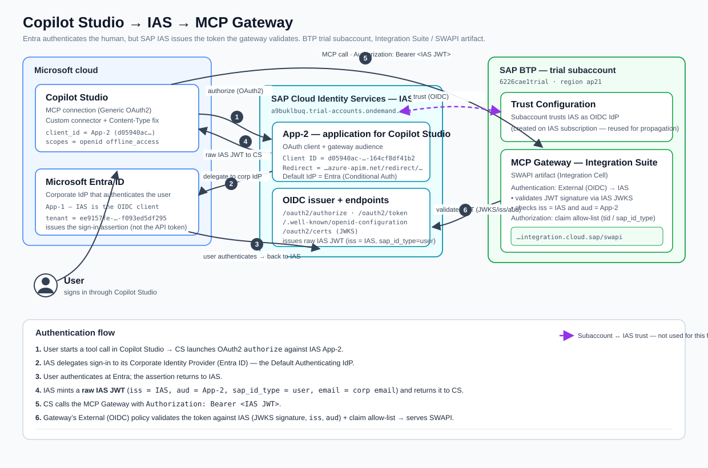

# MCP Gateway on SAP Integration Suite — user authentication with SAP Cloud Identity Services (IAS), federated to Microsoft Entra ID

Connect **Microsoft Copilot Studio** to the SAP **MCP Gateway** on Integration Suite where **SAP Cloud Identity Services – Identity Authentication (IAS)** is the identity provider the gateway trusts, and **Microsoft Entra ID is federated into IAS** for the corporate login. Each end user calls the MCP Gateway with their **own identity** (single sign-on through their Microsoft account), and the token the gateway validates is **IAS-issued** — the exact token shape SAP consumes for **principal propagation** into a real backend.

📺 **Watch the video:** _link coming soon_

This is the follow-up to *"MCP Gateway — user authentication with Microsoft Entra ID"* ([guide](./mcp-gateway-entra-id-copilot-studio.md) · [video](https://www.youtube.com/watch?v=jE-qlg2vZ6I)), which in turn built on *"MCP Gateway on BTP Integration Suite"* ([guide](./mcp-gateway-integration-suite-copilot-studio.md) · [video](https://youtu.be/1m12OVONavA)). The MCP server setup on SAP Integration Suite is the same — same Star Wars API, same exposed tools. What changes here is **who issues the token**:

| | Entra-ID guide | This guide |
|---|---|---|
| Token issuer (`iss`) the gateway validates | **Entra ID** | **SAP IAS** |
| Corporate login | Entra ID directly | **Entra ID federated into IAS** (IAS brokers to Microsoft) |
| Gateway policy | External auth, audience = Entra app, scope `sap.access` | External auth, audience = IAS OAuth client **+ issuer** (IAS has **no custom scopes**) |
| Identity in the gateway | Entra user (UPN + scope) | **IAS user** (`mail`), ready for **principal propagation** |
| What comes next | token exchange (conceptual) | **on-prem ABAP principal propagation** via Cloud Connector (Phase 2 — covered in the next video, publishing soon) |

> The MCP Gateway is one of two architectures explicitly **endorsed by SAP** in the [SAP API Policy](https://help.sap.com/doc/sap-api-policy/latest/en-US/API_Policy_latest.pdf). Putting IAS in front is also SAP's **strategic direction** (IAS + AMS, replacing XSUAA) — so validating a raw IAS token is the future-proof pattern, not a workaround.

---

## Why IAS in front?

Establishing IAS as the front door **freezes the login chain**. Once Copilot Studio, IAS, Entra federation, and the gateway policy are wired to an **IAS-issued** token, the natural extension — propagating that same token to an on-prem ABAP backend — becomes **purely additive**: no rework of Entra, IAS, gateway, or Copilot Studio config.

- **Phase 1 (this guide)** — the *front door*: Copilot Studio → IAS (OIDC) → Entra (corporate login) → back to IAS → **IAS JWT** → gateway validates. Backend (SWAPI) is still called anonymously.
- **Phase 2 (additive next step — covered in the next video, publishing soon)** — the *same* IAS token drives execution as the real ABAP user on-prem, via the Connectivity Proxy + Cloud Connector (identity → short-lived X.509 → `CERTRULE` → SU01 user). See [Next steps](#next-steps--on-prem-principal-propagation-phase-2).

---

## Architecture



```
User
 → Copilot Studio (auto-created custom connector, generic OAuth2 → IAS)
 → IAS (OIDC)  ──corporate IdP federation──►  Entra ID  ──►  back to IAS
 → raw IAS JWT   (iss = <ias-host>, aud = IAS OAuth client, mail = corporate email)
 → MCP Gateway (SAP Integration Suite / Integration Cell)
       External (OIDC) policy validates the IAS JWT                         ◄── Phase 1 ends here
 → SWAPI (Star Wars API)   (still an anonymous backend call)

 ... later, additively ...
 → Destination (Authentication = PrincipalPropagation, forwards the IAS token)  ◄── Phase 2
 → Connectivity Proxy + Cloud Connector — identity → short-lived X.509 (CN = mail)
 → on-prem ABAP backend — CERTRULE maps CN(email) → SU01 user → runs as the real user
```

Everything from Copilot Studio through "gateway validates" is **identical in both phases**. Phase 2 only **adds** the destination + Cloud Connector legs.

### The two app registrations (read this first)

You create **two separate registrations**. They are NOT the same thing — mixing them up is the number-one clean-slate gotcha.

| | **App-1 — Entra registration** | **App-2 — IAS application** |
|---|---|---|
| Where | Entra ID (Azure portal) | IAS Admin console |
| Purpose | Lets **IAS** log users in **via Entra** | The client **Copilot Studio** uses; the **`aud`** the gateway validates |
| Who is the client? | **IAS** is the client, **Entra** is the IdP | **Copilot Studio** is the client, **IAS** is the IdP |
| Redirect URI | The **IAS corporate-IdP callback** (IAS shows it) | Copilot Studio's `https://global.consent.azure-apim.net/redirect/<generated-path>` (added in Step 5) + a temporary `http://localhost:8080/callback` for testing |
| Secret? | Yes (used inside the IAS corporate-IdP config) | Yes (used by Copilot Studio OAuth) |
| Key claim it must emit | `email` | (IAS mints this token) `iss` = IAS, `aud` = App-2 client ID, `mail` = corporate email |

---

## Prerequisites

- An SAP BTP account with **Integration Suite** provisioned, roles assigned, and the **Integration Cell** enabled. See [Activate the Integration Cell](https://help.sap.com/docs/integration-suite/isuite-integrations-and-apis/activate-integration-cell?version=CLOUD).
- A deployed **MCP Server** artifact on Integration Suite exposing the Star Wars API (see the [first guide](./mcp-gateway-integration-suite-copilot-studio.md) for the build steps and [`swapi-openapi-301.yaml`](./swapi-openapi-301.yaml)).
- An **SAP Cloud Identity Services – Identity Authentication (IAS)** tenant where you can create a corporate identity provider and an application (admin access to `https://<ias-host>/admin/`). No IAS tenant yet? **Step 0** provisions one from your BTP subaccount.
- A **Microsoft Entra ID** tenant (the same tenant as your Copilot Studio) where you can register an application and grant admin consent.
- **Microsoft Copilot Studio** access.
- VS Code with the **REST Client** extension (to replay and inspect the flow).

### Values to fill in (single source of truth)

Keep these handy — you collect them as you go. Never commit the secrets.

| Key | Value |
|---|---|
| IAS tenant host | `<ias-host>` (e.g. `xxxxxxxxx.accounts.ondemand.com`) |
| Entra tenant ID | `<entra-tenant-id>` |
| Gateway endpoint | `https://<your-integration-suite-host>/swapi` |
| Copilot Studio consent redirect (connection-specific) | `https://global.consent.azure-apim.net/redirect/<generated-path>` — copy from Copilot Studio on **Create**; it changes if the connection is recreated (re-add to App-2). Note: **`apim.net`**, *not* `apihub.net`. |
| **App-1** (Entra federation) client ID / secret | `<app1-client-id>` / *(store locally)* |
| IAS corporate-IdP callback URL | `<ias-callback>` (IAS shows this) |
| **App-2** (IAS) OAuth **Client ID** / secret | `<app2-client-id>` / *(store locally)* |
| IAS discovery | `https://<ias-host>/.well-known/openid-configuration` |
| IAS JWKS | `https://<ias-host>/oauth2/certs` |

---

## Step-by-step (Phase 1 — the front door)

### 0. (Clean slate) Provision IAS from your BTP subaccount

Skip this if you already have an IAS tenant. Provisioning IAS **via the subaccount** matters: the tenant inherits the subaccount's SAP customer ID, so the subaccount automatically **trusts** it as an identity provider — the prerequisite Phase 2 relies on.

1. **BTP Cockpit → your subaccount → Service Marketplace → `Cloud Identity Services`** → **Create** (Plan: `default`). Provisioning a fresh trial tenant takes a few minutes (up to ~15).
2. When **Instances and Subscriptions → Subscriptions** shows *Cloud Identity Services* as **Subscribed**, the tenant host is minted (e.g. `<ias-host>`). The admin console is that host + **`/admin/`** — record it in the Values table.
3. **Activate the administrator:** provisioning emails the account tied to your BTP trial an *"Activate Your Account"* link (check spam). Click it, set a password — you are now the IAS admin. *(Expired link? Re-send it from Instances and Subscriptions, or use the tenant's forgot-password flow.)*
4. **Confirm the subaccount already trusts IAS:** subaccount → **Security → Trust Configuration** → expect an **OpenID Connect / SAP Cloud Identity Services** entry pointing at your IAS tenant. No action — just confirm it exists.

### 1. Federate Entra ID into IAS

**1.1 — IAS: create the Corporate Identity Provider shell**
IAS Admin → **Identity Providers → Corporate Identity Providers → Create**.
- Display name: `Entra ID`
- Protocol: **OpenID Connect**
- **Save.** IAS now shows a **Redirect / OIDC callback URL** for this IdP (typically `https://<ias-host>/oauth2/callback`). **Copy that exact string** — it becomes App-1's redirect URI.

**1.2 — Entra: create App-1 (IAS is the client)**
Azure portal → **Entra ID → App registrations → New registration**.
- Name: e.g. `IAS Federation (SAP IAS as client)`
- Supported account types: **Single tenant**
- **Redirect URI**: platform **Web** → paste the IAS callback from 1.1.
- **Certificates & secrets → New client secret** → copy the **Value** (App-1 secret).
- **Token configuration → Add optional claim → ID → `email`** (add `upn` if offered; enable the Microsoft Graph email permission if prompted). The `email` claim must be emitted.
- Copy the **Application (client) ID** = App-1 client ID.

> App-1 needs **no API permissions** beyond the default `openid` / `profile` / `email`. It is only a federation bridge.

**1.3 — IAS: finish the Corporate IdP**
Back in the IAS Corporate IdP → **OpenID Connect Configuration**:
- Discovery / Well-Known URL: `https://login.microsoftonline.com/<entra-tenant-id>/v2.0/.well-known/openid-configuration` → **Load**.
- Client ID / Secret: the App-1 values.
- Scopes: `openid profile email`.
- Subject / Name ID mapping: **email** (map Entra `email` → IAS subject).
- **Identity Federation:** leave *"Use Identity Authentication user store"* **OFF** and *"Allow Identity Authentication users only"* **OFF**. IAS then acts as a pure **broker** to Entra — no local shadow user is required. What matters for Phase 2 is not a stored IAS user but a **consistent `email` claim** (Entra `email` == IAS `mail` == ABAP SU01 email).
- Click **Verify** → sign in at the Microsoft prompt → grant consent → expect all green.

> A *"Refresh Token missing from Response"* message during Verify is a **warning, not an error** — IAS only issues a refresh token when the request includes `offline_access`. For Copilot Studio you will add `offline_access` so the connection can refresh silently.

**✅ Verify 1 — endpoints & issuer sanity.** Run [`verify-step1-discovery.http`](./verify-step1-discovery.http). Expected:
- IAS discovery returns `"issuer": "https://<ias-host>"` plus `authorization_endpoint`, `token_endpoint`, `jwks_uri`.
- IAS `jwks_uri` returns a key set (`keys[]`) — proves the gateway can fetch signing keys later.
- Entra discovery returns `"issuer": "https://login.microsoftonline.com/<entra-tenant-id>/v2.0"`.

*(The full federation proof comes in Verify 2 — the first real login is what exercises the Entra → IAS hop.)*

### 2. Create the IAS application (App-2 — the Copilot Studio client & gateway audience)

**2.1 — IAS: create the Application**
IAS Admin → **Applications & Resources → Applications → Create**.
- Display name: e.g. `Copilot Studio MCP`, Type: **OpenID Connect**.
- **Single Sign-On → OpenID Connect Configuration** ("Configure Manually"):
  - **Redirect URIs**: `http://localhost:8080/callback` (temporary — for the Verify 2 manual test; remove afterward). You add the **Copilot Studio** redirect (`https://global.consent.azure-apim.net/redirect/<generated-path>` — **`apim.net`, not `apihub.net`**; connection-specific) in **Step 5**, once Copilot Studio generates it on **Create**.
  - **Grant Types**: at minimum **Authorization Code** + **Refresh Token**.
  - **Enforce PKCE (S256): OFF** (Power Platform's generic OAuth2 does not send PKCE).
- **Subject Name Identifier / Attributes**: ensure **email** is sent (needed as the `mail`/`email` claim and for Phase 2 CN mapping).
- **Default Identity Provider** = the `Entra ID` corporate IdP from Step 1, so login federates straight to Microsoft (no IAS home-realm prompt).

**2.2 — IAS: client secret (this is where the OAuth Client ID is born)**
- **Application APIs → Client Authentication → Secrets → Add** → copy the generated **Client ID** and the **secret** into your Values table (store the secret locally, never in the repo).

> **IAS identifier gotcha:** an IAS application has an **Application ID** (an admin-only identifier) *and* a separate **OAuth Client ID** generated when you add a secret under *Application APIs → Client Authentication*. **The OAuth flows and the token `aud` use the OAuth Client ID — not the Application ID.**

> **IAS scope gotcha:** IAS is an identity provider, **not** a general OAuth2 authorization server, so it **rejects custom scopes** (`sap.access` → `invalid_scope`). The only legal scopes are `openid`, `email`, `profile`, `offline_access`, `groups`. Gateway authorization therefore relies on **audience + IAS groups**, not a custom scope (see step 4).

**✅ Verify 2 — full auth-code flow (proves Step 1 *and* Step 2).** Use [`verify-step2-ias-token.http`](./verify-step2-ias-token.http).
1. Open the authorize URL in a browser. You should be **redirected to the Microsoft login page** (this proves federation). Sign in with your corporate account; the browser lands on `http://localhost:8080/callback?code=…` (the page won't load — that's expected). **Copy the `code`.**
2. Exchange the code for tokens at the IAS token endpoint (client auth = OAuth Client ID + secret).
3. Decode the `access_token` (paste into [jwt.ms](https://jwt.ms) or use the PowerShell snippet below). Success criteria:

| Claim | Expected |
|---|---|
| `iss` | `https://<ias-host>` **(IAS, NOT Entra)** |
| `aud` / `azp` | your **App-2 OAuth Client ID** |
| `mail` / `email` | your corporate email |
| `sap_id_type` | `user` — proof this is a **native SAP identity** (also lets you reject technical / client-credentials tokens) |
| header `alg` | `RS256` (a signed JWT — three dot-separated parts) |
| `groups` | present only if you requested `scope=openid groups` (used in step 4) |

```powershell
$jwt = "PASTE_ACCESS_TOKEN"
function Decode($seg){ $s=$seg.Replace('-','+').Replace('_','/'); switch($s.Length%4){2{$s+='=='}3{$s+='='}}; [Text.Encoding]::UTF8.GetString([Convert]::FromBase64String($s)) }
$p = $jwt.Split('.'); "HEADER:"; Decode $p[0] | ConvertFrom-Json | ConvertTo-Json; "PAYLOAD:"; Decode $p[1] | ConvertFrom-Json | ConvertTo-Json
```

### 3. Switch the SAP MCP policy to external (OIDC) authentication → IAS

On the SWAPI gateway artifact → **Policies → Authentication → Policy Settings**, change from the default client-certificate auth to **External OAuth (OIDC)** so that **IAS issues** the token and the **MCP Gateway validates** it. The UI uses a single **Well-Known URL** and auto-derives `issuer` and `jwks_uri` from it. The Key fields take **Camel expressions** rooted at `authn.oidc` (`.jwt.<claim>` reads the validated token, `.userinfo.<claim>` reads the OIDC UserInfo endpoint).

| Field | Value |
|---|---|
| **External OAuth (OIDC)** | ✅ checked |
| **Configuration Type** | `Well-Known URL` |
| **Well-Known URL** | `https://<ias-host>/.well-known/openid-configuration` |
| **Audience** | your **App-2 OAuth Client ID** |
| **ClientID Key** | `${authn.oidc.jwt.aud}` — reads `aud` from the token; the policy checks it equals **Audience** |
| **UserInfo Key** | `${authn.oidc.userinfo.email}` (fallback `${authn.oidc.userinfo.sub}` / `${authn.oidc.jwt.sub}`) — the `email` is what Phase 2 maps to the ABAP user |

> **Camel-root gotcha:** the Key fields must root at `authn.oidc` — not `auth`, not `header`. The Entra-ID guide used `${authn.oidc.jwt.appid}` (an Entra claim); for **IAS** use `${authn.oidc.jwt.aud}`.

**Save and deploy.** Saving re-versions the artifact and disables XSUAA on it (expected).

**✅ Verify 3 — call the gateway with the IAS token.** Run **Step C** of [`verify-step2-ias-token.http`](./verify-step2-ias-token.http): send an MCP `initialize` to `/swapi` with `Authorization: Bearer <IAS access_token>`. It should **succeed only after step 3** is deployed (it fails before — that's correct, and confirms the policy is actually enforcing).

### 4. Configure authorization (audience + issuer; optional tenant allow-list)

IAS has no custom scopes, so you authorize on claims IAS *does* emit — **not** on `sap.access`.

**Primary allow-list — already enforced by Step 3.** The Authentication policy only admits tokens whose `aud` = your App-2 OAuth Client ID and `iss` = your IAS tenant. On a small or trial user set, **this is sufficient — no extra config is required.**

**Optional org-wide allow-list — the Entra tenant (`tid`).** To restrict access to your corporate directory, add an **Authorization** node of type **"OAuth Scope or Developer Key"** (two fields: **Scope Key** = the claim to read, **Scope** = the required value):

| Priority | Scope Key | Scope | Purpose |
|---|---|---|---|
| 🥇 Recommended | `tid` | `<entra-tenant-id>` | Only users from your Entra tenant/directory |
| 🥈 Hygiene | `sap_id_type` | `user` | Reject technical / client-credentials tokens |
| 🛟 Fallback | `scope` | `openid` | Always present — proves the node works |

> **Test after saving.** This node was designed around OAuth *scopes*, so reading arbitrary claims (`tid`, `sap_id_type`) may not work on every tenant. If your valid token is suddenly *rejected*, fall back to Scope Key `scope` = `openid`, or delete the Authorization node and rely on Step 3's `aud` + `iss` (already a solid allow-list).

> **⚠️ Why not IAS groups?** In **broker mode** (Step 1: user store OFF, default IdP = Entra) IAS **ignores** application attribute mappings, so a `groups` attribute sourced from the IAS Identity Directory will **not populate** — Directory groups only exist for users stored *in* IAS, and here you broker to Entra. For genuine per-group authorization, emit the group from **Entra** instead:
> 1. Create an Entra security group and add the users.
> 2. App-1 (Step 1) → **Token configuration** → add the **`groups`** claim.
> 3. IAS → map the group **from the corporate IdP** (corporate-IdP attribute mapping), **not** Identity Directory.
> 4. Request `scope=openid groups`; require the group value in the Authorization node.

**Save and deploy.**

### 5. Wire Copilot Studio to IAS (OAuth)

1. In your agent, **add a tool → Model Context Protocol**. Give it a name (e.g. *"SWAPI MCP Gateway with IAS"*) and a description.
2. **Server URL**: your gateway endpoint (`https://<your-integration-suite-host>/swapi`).
3. **Authentication → OAuth (generic), Manual**:
   - **Client ID / Client secret**: the App-2 OAuth Client ID + secret.
   - **Authorization URL**: `https://<ias-host>/oauth2/authorize`
   - **Token URL**: `https://<ias-host>/oauth2/token`
   - **Refresh URL**: `https://<ias-host>/oauth2/token` — **same as the Token URL**. IAS has no separate refresh endpoint; refresh uses `grant_type=refresh_token` against `/oauth2/token`.
   - **Scope**: `openid offline_access` — **`offline_access` is required**, or IAS returns no refresh token and silent refresh fails (the *"Refresh Token missing"* warning). Add `groups` only if you configured Step 4 Option B (Entra-sourced groups).
4. Click **Create**. Copilot Studio generates a **redirect URL** (`https://global.consent.azure-apim.net/redirect/<generated-path>` — `apim.net`, connection-specific). **Copy it** and register it in **IAS App-2 → Single Sign-On → OpenID Connect Configuration → Redirect URIs**. **Do not touch Entra** — Copilot Studio calls IAS directly, so only IAS needs to trust this redirect (Entra already trusts IAS's callback from Step 1). After any connector/connection edit, **recreate the connection and wait ~1–2 min** (Power Platform caches metadata).

### 6. Fix the Content-Type in the auto-created custom connector

Copilot Studio sends `Content-Type: application/json; charset=utf-8`, but the SAP MCP handler does a **strict equality check** and accepts **only** `application/json`. Just like the Entra-ID guide, patch the auto-created custom connector:
1. **Power Automate → Custom connectors** → find the connector Copilot Studio created in the background.
2. **Edit → Code** view: enable the code and replace the script with [`custom-connector-script.csx`](./custom-connector-script.csx), which forces the outgoing `Content-Type` to exactly `application/json` and leaves the **Authorization** (IAS bearer) and **Accept** headers untouched.
3. **Update connector.** Allow a minute or so for the change to replicate.

### 7. Verify end-to-end in Copilot Studio

1. **Recreate the connection and wait ~1–2 minutes** — Power Platform caches connector/connection metadata. Then **refresh** — the **list of tools** appears.
2. On first connect you get a sign-in pop-up; because App-2's default IdP is the Entra corporate IdP, you authenticate with **your own Microsoft account** (single sign-on), and IAS mints the token.
3. Ask a question, e.g. *"What can you tell me about episode 5?"* The agent picks the right tool (`getFilm`) and returns the film — calling the MCP Gateway in the signed-in user's context, validated as an **IAS** token. ✅ Phase 1 done.

---

## Next steps — on-prem principal propagation (Phase 2)

> 📺 **Phase 2 will be covered in the next video, publishing soon.** The outline below previews what that video walks through end-to-end.

The gateway now holds a **validated IAS token** carrying the user's `mail`. The natural extension is to run the actual backend call **as the real ABAP user on-prem** — and because the token is already IAS-issued, this is **additive**: you don't touch Entra, IAS, the gateway auth policy, or Copilot Studio.

You do **not** manually exchange the token. The **Connectivity Proxy + Cloud Connector** convert the identity into a short-lived X.509 client certificate; ABAP maps the certificate to a user.

```
IAS JWT (mail = user email)
  │  gateway destination presents it to the Connectivity Proxy via two headers:
  │     SAP-Connectivity-Authentication: <IAS user token>
  │     Proxy-Authorization:             <connectivity proxy token>
  ▼
Connectivity Proxy + Cloud Connector — validates the IAS token, mints a SHORT-LIVED X.509 (CN = mail)
  ▼
On-prem ABAP  →  CERTRULE: SUBJECT CN = <email> → SU01 user  →  request runs as the real user
```

Outline of the additive work:
- **Subaccount trust to IAS** — the subaccount that will issue/consume the token must trust the same IAS tenant.
- **Cloud Connector 2.13+** — connected to that subaccount, with the on-prem backend mapped as an accessible resource (note the **Location ID**).
- **Principal propagation config** — Cloud Connector CA cert with subject pattern `CN = ${mail}`; ABAP **STRUST** (trust the CC CA) + **CERTRULE** (`SUBJECT CN = <email>` → SU01 user) + **SU01** email == IAS `mail` == Entra `email`.
- **BTP Destination** — `Authentication = PrincipalPropagation`, `ProxyType = OnPremise`, `CloudConnectorLocationId = <Location ID>`, URL = backend host:port.
- **The bridge to prove first** — confirm your specific gateway artifact **forwards the inbound IAS token** into the `PrincipalPropagation` destination call (so the Connectivity Proxy receives `SAP-Connectivity-Authentication`). This is the one artifact-specific link to validate before committing to Phase 2.

> **Reference:** *Configure Principal Propagation via IAS Token* — SAP BTP Connectivity documentation (`help.sap.com/docs/connectivity/sap-btp-connectivity-cf/configure-principal-propagation-via-ias-token`). This is a documented standard feature, not a workaround.

---

## VS Code — replay & inspect the flow

Two REST Client snippets accompany this guide:

- [`verify-step1-discovery.http`](./verify-step1-discovery.http) — confirms the IAS + Entra discovery documents resolve and the **IAS issuer** is correct (what the gateway will trust).
- [`verify-step2-ias-token.http`](./verify-step2-ias-token.http) — the full IAS authorization-code flow (Microsoft login → IAS token), decode the JWT, then optionally call the MCP Gateway.

> **Notes**
> - IAS App-2 is a **confidential** client (has a secret, **no PKCE**).
> - The authorization `code` is **single-use** and short-lived; use the `refresh_token` (from `offline_access`) to renew the access token.
> - The MCP transport requires **both** `application/json` and `text/event-stream` in the `Accept` header.
> - SAP requires an exact `Content-Type: application/json` (no `charset` suffix) — that's what the custom-connector C# script enforces.
> - The `tools/list` call reuses the `Mcp-Session-Id` returned by the `initialize` response header.
> - **Never commit** the real client secret or authorization codes. The `.http` files ship with placeholders.

---

## References

- SAP Reference Architecture (MCP Gateway) — <https://architecture.learning.sap.com/docs/ref-arch/d2e34e>
- SAP API Policy (PDF) — <https://help.sap.com/doc/sap-api-policy/latest/en-US/API_Policy_latest.pdf>
- Activate the Integration Cell — <https://help.sap.com/docs/integration-suite/isuite-integrations-and-apis/activate-integration-cell?version=CLOUD>
- Configure Principal Propagation via IAS Token — <https://help.sap.com/docs/connectivity/sap-btp-connectivity-cf/configure-principal-propagation-via-ias-token>
- SAP Cloud Identity Services — Identity Authentication — <https://help.sap.com/docs/identity-authentication>
- IAS: Configure a corporate identity provider (OpenID Connect) — <https://help.sap.com/docs/identity-authentication/identity-authentication/configure-openid-connect-corporate-identity-provider>
- Microsoft identity platform — Authorization code flow — <https://learn.microsoft.com/entra/identity-platform/v2-oauth2-auth-code-flow>
- Write code in a custom connector — <https://learn.microsoft.com/connectors/custom-connectors/write-code>
- Previous guide — MCP Gateway with Microsoft Entra ID — [`mcp-gateway-entra-id-copilot-studio.md`](./mcp-gateway-entra-id-copilot-studio.md)
- First guide — MCP Gateway on SAP Integration Suite — [`mcp-gateway-integration-suite-copilot-studio.md`](./mcp-gateway-integration-suite-copilot-studio.md)
- Star Wars API — <https://swapi.info/>
